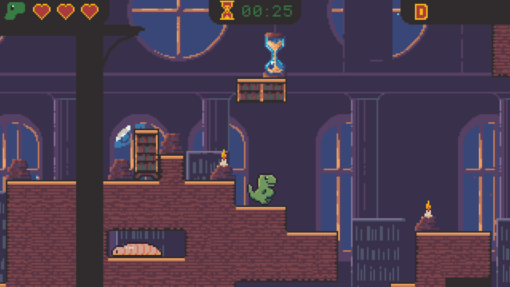
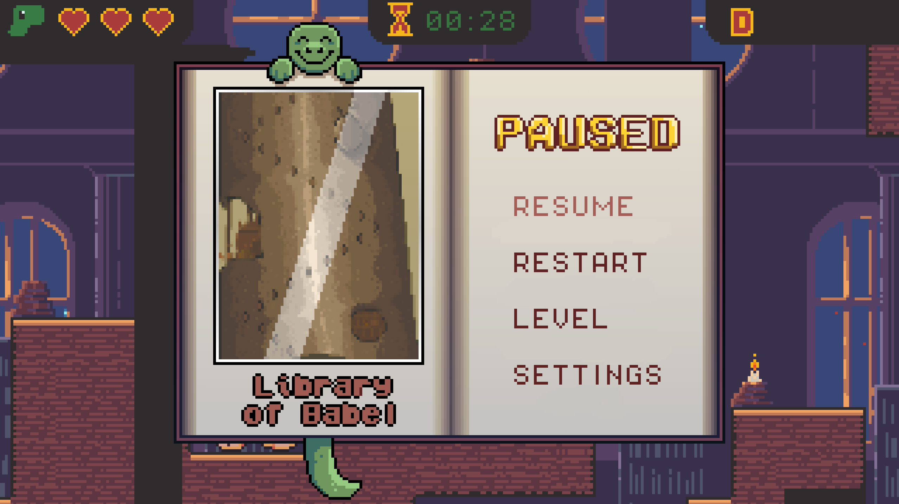

# library_of_babel
Platformer Game - The Library of Babel

---

> _**"La Biblioteca existe ab aeterno. De esa verdad cuyo corolario inmediato es la eternidad futura del mundo, ninguna mente razonable puede dudar."**_  
> — Jorge Luis Borges, *La Biblioteca de Babel*

---
## Dependencies
- Python >= 3.10 [How to Install Python?](https://www.geeksforgeeks.org/how-to-install-python-on-windows/)

- pygame >= 2.6 [How to install packages?](https://packaging.python.org/en/latest/tutorials/installing-packages/)
- moderngl >= 5.12

## Installation

- Download code as zip and extract (or clone this repository)
- Install dependencies
- Run main.py

## How To Play
- Move with WASD or arrow keys
- Press [ESC] while in-game to open settings menu
- While in settings menu, press [R] to reset game progress
- Press [Q] to quit game to desktop

## Screenshots
 

